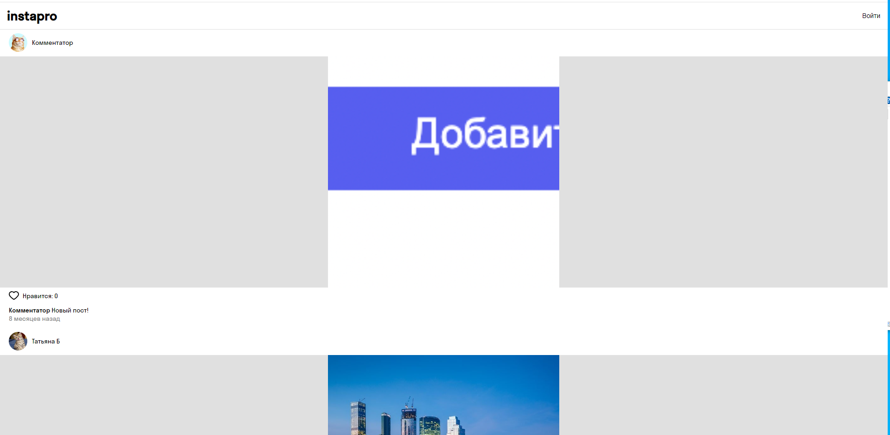
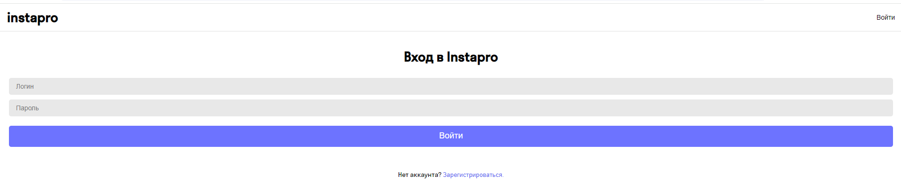

# Instapro
Проект "Аналог Instagram" 

##  Описание проекта:
Приложение Instapro для публикации фотографий.
2 алгоритма поведения - зарегистрированный юзер и гость.
Гостю доступен просмотр ленты фотографий, просмотр профиля пользователей, регистрация.
Юзеру доступна публикация/удаление фотографий, возможность лайкнуть/дизлайкнуть фотографии других пользователей. 

## Технический стек
-   React
-   REST API

## Установка и запуск проекта:
-   Необходимо клонировать репозиторий git clone git@github.com:tanya-bulaeva/webdev-cw-instapro.git
-   Установить зависимости: npm install;
-   Для просмотра на localhost  http://127.0.0.1:5500/

  
## Ссылка на приложение:
https://tanya-bulaeva.github.io/webdev-cw-instapro/

## Визуал:

